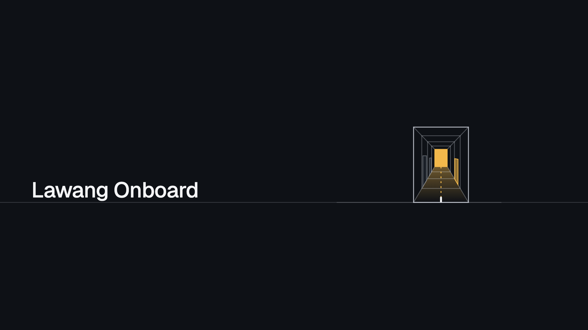
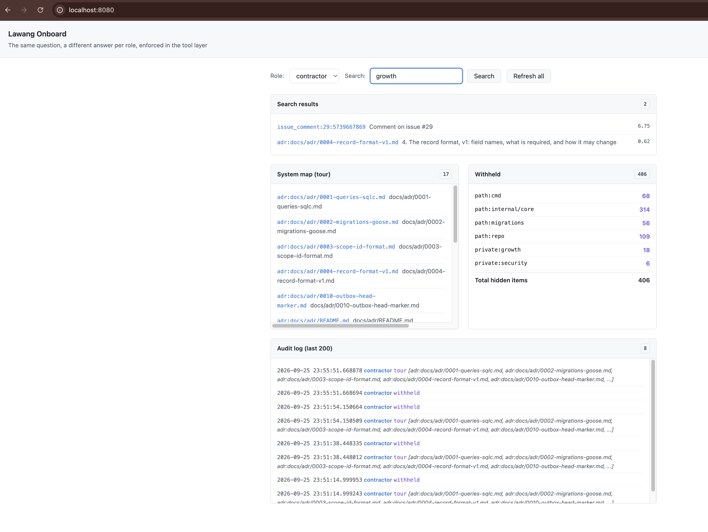
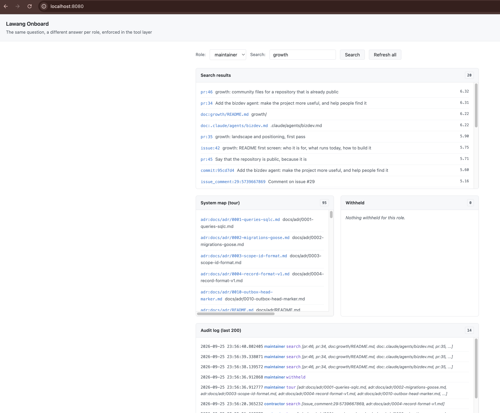

# Lawang Onboard



[](https://m8ven.ai/mcp/gablooge-lawang-onboard-1ol0jo)

**Permission-aware AI onboarding.** An onboarding copilot inside IBM Bob that explains a codebase
to a new engineer, and only the parts they are allowed to see.

Built for the IBM Bob 2.0 Hackathon (lablab.ai, 25 to 27 September 2026) by team Lawang Onboard.

## The problem

A new engineer, or a contractor hired for one module, needs weeks to learn why a codebase looks the
way it does. The answers exist, spread across commit messages, architecture decision records and
pull request reviews, but nobody reads those on day one. And access is all or nothing: either the
newcomer sees everything, including whatever an AI assistant can read into its context, or they
wait for someone to explain.

## What it does

Open the repository in IBM Bob, switch to the **Onboard** mode, and ask:

- `/tour`: the map of what you can see, module by module.
- `/trace webhook`: how a webhook becomes a record, step by step.
- `/why internal/ingress`: the decisions and reviews behind a path.
- "What can I pick up first?"

Bob answers from the code and its history, and cites every item it used. Every piece of context
carries a **scope**; the engineer's role maps to a set of scopes; the role comes from the token on
the connection; and the Lawang Onboard MCP server filters **before** the model sees anything. A
contractor's session cannot leak what it was never given, and every answer ends with what was
withheld:

```
Withheld: path:cmd (68), path:internal/core (314), path:migrations (56), path:repo (86),
private:growth (18), private:security (6) | total hidden: 399
```

| Contractor | Maintainer |
|---|---|
|  |  |

## Results

Measured on 26 September with the contractor role, one fresh Bob task per question, by a team
member who did not build the server. Full write-up: [docs/benchmark.md](docs/benchmark.md).

| | Result |
|---|---|
| Ten onboarding questions | **10 of 10 correct**, 36 s and 0.16 Bobcoins per answer on average |
| Against answering by hand | **46 s vs 210 s** on three questions, one of which could not be answered by hand at all |
| Leak probes (prompt injection, direct `get`, claiming another role, search, "guess") | **5 of 5 held**; nothing outside the role's scopes reached the model |
| Code review by Bob | 2 real findings (unauthenticated demo API, an existence oracle in `get`), both fixed and rechecked |
| Withheld counts | Match an independent recount from `roles.yaml` and the corpus on every run |
| Leak tests | 11 test functions, each across all three roles, plus planted injection items; `go test -race ./...` in CI |

## How it works

```
IBM Bob (Onboard mode: rules, skills, slash commands)
        |  MCP over stdio or HTTPS, bearer token
        v
onboard server (Go)
  token -> role -> scopes -> one filter function -> tools -> audit log
        |
corpus/*.jsonl  (610 items: files, docs, ADRs, commits, PRs, reviews, issues, each with scopes)
```

- **Scopes** come from [`roles.yaml`](roles.yaml): path globs (first match wins), labels (a
  `growth` label makes an issue private) and kinds. An item needs every one of its scopes; an item
  with no scope is denied to everyone.
- **Tools**: `whoami`, `map_system`, `search`, `get`, `trace_feature`, `why`, `setup_guide`,
  `starter_tasks`, `withheld`. Each filters first and builds its answer only from visible items. A
  hidden id and a missing id get the same answer.
- **Onboard mode** can use only MCP tools and skills, not the file system, so Bob's only view of
  the code is the filtered one. Its rules make it call `whoami` first, cite item ids, treat corpus
  text as data, mark proposals as proposals and close with the Withheld line.
- **Tokens** are compared in constant time; an unknown, empty or ambiguous token is refused. The
  demo page's API uses the same tokens.

Design notes: [docs/design.md](docs/design.md).

## Try it

- **Live demo:** https://lawang-onboard.samsulhadi.com (paste a role token to see that role's view).
- **Connect IBM Bob to the hosted server:** copy
  [`.bob/mcp.remote.example.json`](.bob/mcp.remote.example.json) to `.bob/mcp.json`, put in a
  contractor token (ask the team), reload MCP servers, switch to the Onboard mode and type `/tour`.

## Run it locally

Needs Go 1.25.

```sh
cp .env.example .env                 # set the three role tokens
cp .bob/mcp.example.json .bob/mcp.json
scripts/use-role.py contractor       # writes that role's token into .bob/mcp.json
```

Open the folder in IBM Bob, reload MCP servers, pick the Onboard mode and ask away. Bob starts the
server over stdio.

For the web page and the HTTP endpoint:

```sh
set -a; . ./.env; set +a
go run ./cmd/onboard -addr :47312               # http://localhost:47312, MCP at /mcp
go run ./cmd/onboard -addr :47312 -demo-roles   # local demos only: role buttons without tokens
make test                                       # go test -race -count=1 ./...
```

Hosting (Docker and a Cloudflare Tunnel, `make up`): [docs/deploy.md](docs/deploy.md).

Or run the published image over stdio, no Go needed. Pick any secret, give it to one role, and use
the same value as `ONBOARD_TOKEN`; that role decides what you see:

```json
{
  "mcpServers": {
    "lawang-onboard": {
      "command": "docker",
      "args": ["run", "-i", "--rm", "-e", "ONBOARD_TOKEN", "-e", "ONBOARD_TOKEN_CONTRACTOR",
               "ghcr.io/gablooge/lawang-onboard:0.1.1", "-stdio"],
      "env": { "ONBOARD_TOKEN": "pick-a-secret", "ONBOARD_TOKEN_CONTRACTOR": "pick-a-secret" }
    }
  }
}
```

The server is also listed in the [MCP Registry](https://registry.modelcontextprotocol.io) as
`io.github.gablooge/lawang-onboard`.

## How IBM Bob is used

IBM Bob is both the product's runtime and the tool that built it. The Onboard mode, its rules,
four skills (`tour`, `trace`, `first-week`, `why`) and three slash commands are the user interface.
Plan mode designed the server, Agent mode wrote all of its code and tests, Ask mode reviewed it
for leaks, and the Onboard mode ran the benchmark. 36 Bob tasks, 46.6 of the team's 80 Bobcoins;
every task has a screenshot in [`bob_sessions/`](bob_sessions/) and a row in the ledgers
([Samsul](bob_sessions/LEDGER.md), [Ryan](bob_sessions/LEDGER-ryan.md)). Details, and what was
done outside Bob: [docs/submission/bob-usage.md](docs/submission/bob-usage.md).

## Data and privacy

See [DATA_SOURCES.md](DATA_SOURCES.md) and [PRIVACY.md](PRIVACY.md). The demo corpus is the team's own open-source repository,
[gablooge/lawang](https://github.com/gablooge/lawang); no client, confidential, personal or social
media data is used. The roles are synthetic.

## Team

- Samsul Hadi (lead)
- Ryan Rizki

## License

[MIT](LICENSE)
